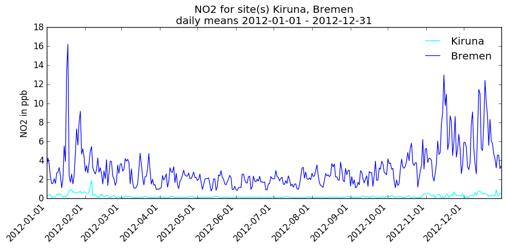

# Open Source EMEP/MSC-W model
Simplified access to the source code, input data and benchmark results

## Get the latest release dataset
```bash
# download the catalog tool
wget https://raw.githubusercontent.com/metno/emep-ctm/tools/catalog.py

# make it executable and run it
chmod +x catalog.py

# get the latest release
catalog.py
```

### Get partial/older datasets
```bash
# help and usage information
catalog.py -h

# retrieve release dataset for revision REV (rv3|v201106|rv4_0|rv4_3|rv4_4|rv4_5|rv4_8|rv4_10)
catalog.py -R REV          

# get only the source code and user guide for revision REV
catalog.py -R REV -sd

# download meteorological input for YEAR (2005|2008|2010..2015)
catalog.py -Y YEAR -m

# download meteorological input for 2015 and EECCA domain
catalog.py -Y 2015 -m --met-domain EECCA

# download meteorological input for 2015 and EMEP01 domain
catalog.py -Y 2015 -m --met-domain EMEP01
```

# Tools to read sites and sondes output

The EMEP model currently provides detailed outputs for selected locations.
The 'sites' outputs provide surface concentrations (at ca. 3m),
and typically many (or all) chemical compounds are provided for each site and hour.
The 'sondes' type of outputs provide vertical profiles,
typically for a selection of compounds (to prevent huge files)
and possibly with time-resolution of e.g. 3 or 6 hours.
The model has historically provided ASCII outputs,
but recently a parallel system with netCDF outputs has been introduced.
In future the ASCII outputs will be removed.

We provide two programs:

* `Rd_ncsites.py`:  python script to read and plot netCDF site files
* `Rd_ncsondes.py`: python script to read and plot netCDF sonde files

The codes have a number of things in common:

* they can be called either directly with site names and  pollutant, or
* they can be used in a simple menu-like approach in which case the user is
  presented with a list of stations, pollutants and other choices as appropriate.
* they produce ASCII files for the desired sites and pollutants.

The python scripts also produce plots, e.g. of daily or monthly mean
concentrations - as time-series for sites data (see [Fig. 1](#fig1)),
and as 2-D plots for sonde data (see [Fig. 1](#fig1)).  


## Rd_ncsites.py and Rd_ncsondes.py

These python (2.7) tools make use of the matplotlib and netCDF4 modules - these are
usually readily available, e.g. in standard Ubuntu repositories.

<a name="fig1"></a>

*Figure 1: Example of Rd_ncsites.py output, daily NO2 values for 2 sites*

<a name="fig2"></a>

*Figure 2: Example of Rd_ncsondes.py output, monthly mean OH values*

### Examples

```bash
# help and usage information
Rd_ncsondes.py -h

# suggest list of sites and then pollutants
# generate outputs after selection
Rd_ncsondes.py -i sondes_2012.nc

# produce ascii outputs and plot    
Rd_ncsondes.py -i sondes_2012.nc -s Bremen -v O3 -pt monmeans -pr entire
```

Usage of Rd_ncsites.py is very similar, but if wanted more than one site can be plotted (as in Fig.1):

```bash
Rd_ncsites.py -i sites_2012.nc -s Bremen,Kiruna -v NO2 -pt daymeans -pr entire
```

The ascii output files are prefixed with SITES or SONDES, for example:

* `SITES_Birkenes_O3.vals`:  Hourly values as 24 column matrix
* `SITES_Birkenes_O3.1hrly`: Hourly values
* `SITES_Birkenes_O3.dmean`: Daily means
* `SITES_Birkenes_O3.dmax`:  Daily max
* `SITES_Birkenes_O3.mmean`: Monthly mean
